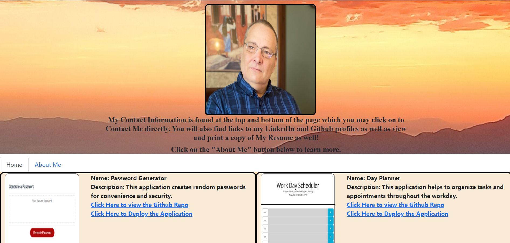

# Showcase Portfolio

* Github Repository Link: https://github.com/bradfan/showcase-portfolio

* Deployed Application Link: 

This portfolio showcases some of my completed projects assigned through the U of A Full Stack Web Development Bootcamp. This application utilizes React.js and also utilizes a Router function to navigate to the About Me page. Like the dynamically created cards which display the indivisual projects, once the framework is set up it is relatively easy to add more content and more routes.

